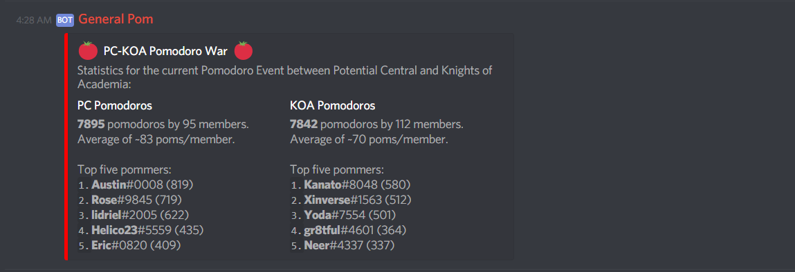

# Pomodoro Event Bot

This bot was created to power the Pomodoro War between the Potential Central and [Knights of Academia](https://knightsofacademia.org/) servers on Discord. The goal of the war was to complete as many Pomodoros as possible. A _pom_ or _pomodoro_ is simply a focused work session of 25 minutes.

Features:

-   Count poms for individual users
-   Leaderboard per server
-   Summary of the war (two leaderboards in one message)



## Installation

This bot was created solely for [Knights of Academia](https://knightsofacademia.org/) and Potential Central. That said, the code is not locked in to their Discord servers and is fully configurable. Example configuration is available in `config_example.js`. The configuration file will be named depending on the value of the `NODE_ENV` environment variable:

```bash
# Run using the configuration from `config_development.js`
node index.js

# Run using the configuration from `config_production.js`
NODE_ENV=production node index.js
```

Database models are in the `models/` directory. You could use those and let [Sequelize](http://docs.sequelizejs.com/) sync the database up for you. You'll have to figure this out using their examples though.

## Contributing

The Pomodoro war has ended and this bot is now retired. Another one will be created for the next war. That said, if you have anything interesting to propose, feel free to reach out to `kindly#0001` on the support server of my Quarko bot ([invite](https://discord.gg/wmA6Bzf)).
